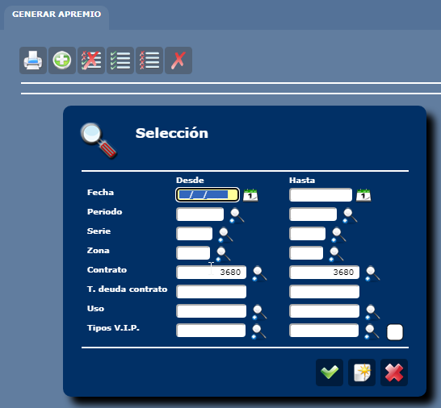
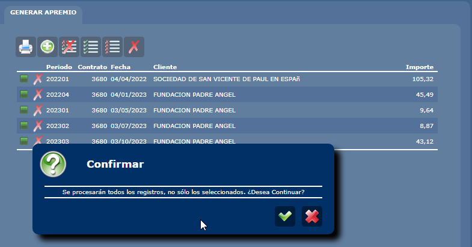
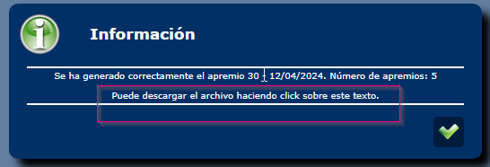

# 💸 BUSCAR APREMIOS
`Cobros\CR034_Apremios.aspx.cs`

> - `ApremiosCab_SelectPorFiltro`
> - `ApremiosCab_Select`

Se incluyen columnas adicionales en la consulta

1. Ordenar del mas reciente
2. Incluir el numero de apremio

# 💸 GENERAR APREMIOS

- Para buscar casos de pruebas empezamos generando todos los apremos para un periodo completo, con esto lo que queremos es meter los datos en la tabla `apremiosTrab`

- Lanzamos la query para ver cuales apremios corresponden a una rectificativa

```SQL
SELECT F.facCod, facPerCod, facCtrCod, facVersion, facNumero 
FROM apremiosTrab AS A
INNER JOIN facturas AS F
ON A.aptFacCod = F.facCod
AND A.aptFacPerCod = F.facPerCod
AND A.aptFacCtrCod = F.facCtrCod
AND A.aptFacVersion = F.facVersion
WHERE F.facVersion>1
````

- Borramos todos los apremios que están pendientes en la pantalla de apremios, esto lo que hace es limpiar los registros que tenemos en  `apremiosTrab` 

- Ahora con uno de los contratos que tienen factura rectificativa por apremiar, vamos ha completar el proceso de apremios hasta generar el fichero.



- Vamos a ver cuales de ellas son rectificativas y cual es la fecha de la factura y la fecha de pago voluntario:

```SQL
SELECT F.facCod, facPerCod, facCtrCod, facVersion, facNumero, facFecha, P.perFecIniPagoVol, P.perFecFinPagoVol
FROM apremiosTrab AS A
INNER JOIN facturas AS F
ON A.aptFacCod = F.facCod
AND A.aptFacPerCod = F.facPerCod
AND A.aptFacCtrCod = F.facCtrCod
AND A.aptFacVersion = F.facVersion
LEFT JOIN periodos AS P
ON P.percod = F.facPerCod
-- WHERE F.facVersion>1
```

- Con este caso vamos a completar el proceso de apremios para ver como quedan las fechas en el fichero.



- Descargar el archivo de apremios para mirar las fechas que ha puesto



> ⚠️ **Importante:** Si has olvidado descargar el archivo, puedes deshacer el apremio generado borrando el registro de la tabla  `Apremios`

```SQL 
SELECT * 
--DELETE
FROM apremios WHERE aprFechaGeneracion>'20240412'

--Caso del syrena
SELECT * 
--DELETE
FROM apremios WHERE aprFacCtrCod=18895 
````

<br>

# 💻 COMPROBAR LOS RESULTADOS
## 🔧apremios-guadalajara.exe


Para sacar los datos de los apremios según las facturas

```SQL
--Para el apremio 28
SELECT F.facCod, facPerCod, facCtrCod, facVersion, facNumero, facFecha, P.perFecIniPagoVol, P.perFecFinPagoVol
FROM apremios AS A
INNER JOIN facturas AS F
ON A.aprFacCod = F.facCod
AND A.aprFacPerCod = F.facPerCod
AND A.aprFacCtrCod = F.facCtrCod
AND A.aprFacVersion = F.facVersion
LEFT JOIN periodos AS P
ON P.percod = F.facPerCod
WHERE A.aprNumero=28
```

Para comprobar los resultados seguir los siguientes pasos:

1. Buscar el directorio `C:\Gdesousa\_Sacyr\sql-sprints\sprint-52\85225-apremios-guadalajara\apremios_parsear_xls` donde tenemos el ejecutable que hace el parseo a excel.

2. Copiar el fichero txt de apremios en el sub directorio `apremios_txt`


3. Comprobar que la configuración hace referencia a las columnas que nos interesa comprobar: `_configuracion\metadata.csv`

<br>

<center>


*En este caso nos interesa ver los valores en las columna de fechas*
</center>
<br>

4. Ejecutar el programa seleccionando el fichero txt de apremios que está en el directorio `dist\apremios-guadalajara.exe`


## 📆 FECHAS EMISION Y VENCIMIENTO

### Casos de prueba: 
#### Las fechas se calculan igual para consumo y mensuales
Contrato de muestra para cada caso 

| Factura | Emisión || Vencimiento | Contratos |
| --------- | --------- |--|--------- |------|
| 📜 Original   | Fecha inicio pago voluntario   | | Fecha fin pago voluntario   | - 🆗**Consumo: `3680`** - **🆗Mensual: `26248`** |
| 📇 Rectificactiva   | Fecha de la factura   |  | Fecha de la factura + 60 dias  | - 🆗**Consumo: `18895`** - 🆗Mensual: `26248` |

> Periodos enteros de pruebas con rectificacadas: 🆗`000001`, `202204`

> Parámetro  `DIAS_PAGO_VOLUNTARIO = 60`

