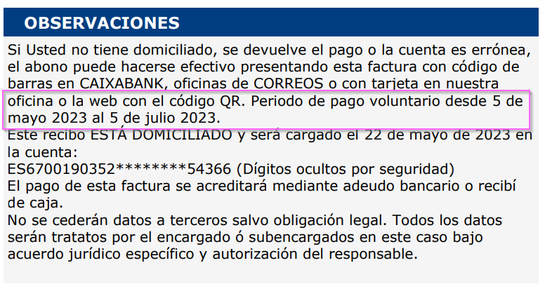
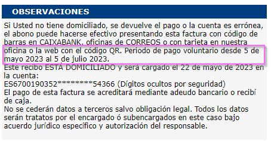
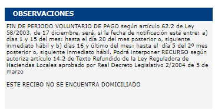
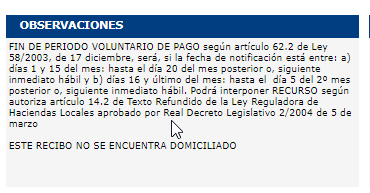
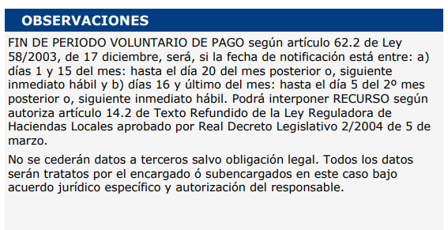

# 📑 Facturas Rectificativas: Observaciones

Se corrige la información sobre la fechas de pago voluntario para las facturas rectificativas.

## 🔍Localizar facturas rectificativas "de consumo"

Las facturas de contado ya tienen el mensaje genérico

```SQL
SELECT TOP 10 * 
FROM facturas AS F
INNER JOIN dbo.contratos AS C
ON F.facCtrCod = C.ctrcod
AND F.facCtrVersion = C.ctrversion
AND C.ctrbaja=0 AND C.ctrfecanu IS NULL
WHERE facVersion>1 order by facPerCod DESC, facFechaRectif DESC
```
|Contrato|Periodo|
|---|----|
|3757|202303|
|63776|000011|

### *Si descargas la factura original del `17/04/2023` y la comparas con la rectificada del `30/10/2023`, ambas hacen referencia a la misma fecha de vencimiento*
|Tipo|Rectificada|Original|
|---|---|----|
|Consumo|  ||
|Contado |  ||




> FIN DE PERIODO VOLUNTARIO DE PAGO según artículo 62.2 de Ley 58/2003, de 17 diciembre, será, si la fecha de notificación está entre: a) días 1 y 15 del mes: hasta el día 20 del mes posterior o, siguiente inmediato hábil y b) días 16 y último del mes: hasta el día 5 del 2º mes posterior o, siguiente inmediato hábil. Podrá interponer RECURSO según autoriza artículo 14.2 de Texto Refundido de la Ley Reguladora de Haciendas Locales aprobado por Real Decreto Legislativo 2/2004 de 5 de marzo