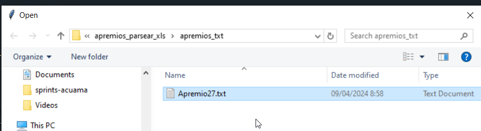
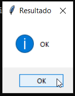
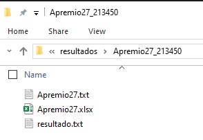
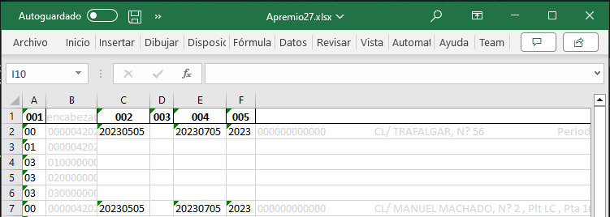

# Proyecto Apremios Guadalajara

Este proyecto nos sirve de apoyo a las pruebas de **Apremios Guadalajara**.

Podemos extraer del txt de apremios las columnas que nos interesan en formato excel.


<pre>
📦_configuracion
 ┗ 📜metadata.csv
 📦resultados

 📜apremios-guadalajara.py
 📜readme.md

</pre>


## Uso

> Selecciona un archivo txt de apremios. Este se genera desde `🚀 acuama/cobros/apremios`


<br>

> Debe mostrarte un mensaje de 🆗 tras la ejecución  


> Si no te salió un ok en el mensaje 🚨, significa que hubo un error en el programa. 

<br>

> En el directorio del ejecutable busca la carpeta `📁 resultados`.



<br>

> En la carpeta resultados debes tener un fichero excel con le mismo nombre que el txt de entrada  `🚁`



## Descripción

Este script procesa archivos de texto con datos de apremios de Guadalajara. 

- Divide las líneas del archivo de texto en columnas según una definición de columnas en un archivo `_configuracion/metadata.CSV`. 

- Basta con indicar la posición de incio y longitud de las columnas que nos interesa examinar.


<pre>
📦_configuracion
 ┗ 📜metadata.csv
</pre>


- La ejecución crea en la carpeta **resultados** un directorio con la fecha de ejecución para el fichero txt de apremios.


1. **Apremio27.txt** es el fichero de entrada
1. **Apremio27.xlsx** es el fichero de salida, las columnas se separan según lo indicado en **metadata.csv**
1. **resultado.txt** fichero utilizado para comprobar el parseo. Debe ser exactamente igual al fichero de entrada-


<pre>
📦resultados
 ┗ 📂Apremio27_193043
 ┃ ┣ 📜Apremio27.txt
 ┃ ┣ 📜Apremio27.xlsx
 ┃ ┗ 📜resultado.txt
</pre>


- guarda los datos en un archivo de Excel, y compara el contenido del archivo de entrada y salida.

## Requisitos

Primero, necesitas instalar Python 3. Puedes descargarlo desde la [página oficial de Python](https://www.python.org/downloads/).

Una vez que tienes Python instalado, puedes instalar las bibliotecas pandas, openpyxl y tkinter usando pip, que es el administrador de paquetes de Python. Abre tu terminal y ejecuta los siguientes comandos:

```bash
pip install pandas
pip install openpyxl
```

## Ejecución

Para ejecutar el script, navega hasta el directorio del script en la terminal y ejecuta:

```bash
python apremios-guadalajara.py
```

En este directorio necesitas:

> 1. Un directorio para los resultados **/resultados**


> 2. El fichero _configuracion/**metadata.csv**

<div style="margin-left: 50px;">

<small>

| INDICE | INICIO ✨| LONGITUD | TIPO | DESCRIPCION |
|--------|--------|----------|------|-------------|
| **string**   | **int**      | **int**        | **string**     |**string**   |
| requerido  | requerido   | requerido       | Opcional    | Opcional   |
| Para la columna   | Posicion de inicio      | Longitud caracteres        |  Tipo    | Desscripcion |

✨ Los valores de INDICE empiezan en 1.

```xls
INDICE;INICIO;LONGITUD;TIPO;DESCRIPCION
001;1;2;;Tipo de Linea
002;326;8;N;"Fecha Emision (AAAAMMDD) en voluntaria: ""Fecha de emision"""
003;334;8;N;"Fecha Notificacion (AAAAMMDD) en voluntaria: ""Fecha de periodo de consumo"""
004;342;8;N;Fecha de Vencimiento (AAAAMMDD), Final del periodo voluntario OBLIGATORIO
005;350;4;4;Año al que se refiere la liqudación YYYY
```
</small>
</div>

## Generar el ejecutable

```bash
pip install pyinstaller

pyinstaller --onefile apremios-guadalajara.py
```

Si te falla la instalación o la ejecucion prueba instalar el pyinstaller con este comando:
```bash
pip install --upgrade --force-reinstall pyinstaller
```


