# Entrada de inspecciones
Se carga el fichero
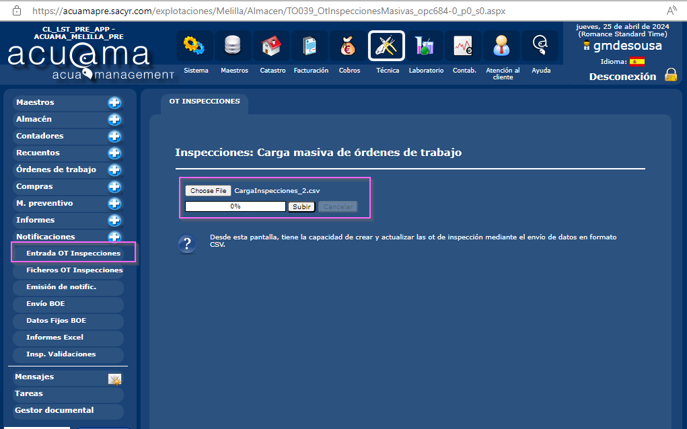

### Plantilla de entrada

```csv
objectid;globalid;fecha_y_hora_de_entrega_efectiv;numeroinspeccion;zona;tipologiacsv;contrato;domicilio;ruta1;ruta2;ruta3;ruta4;ruta5;ruta6;incidencias;tipoincidencia;servicio;direccion_1;viviendas;facilacceso;armariobuenestado;arquetaconpuerta;arquetafachada;arquetanivelsuelo;caracteristicas;ncontadores;calibrecontador;calibre13;calibre15;calibre20;calibre32;calibre40;calibre50;materialtuberias;llavepaso;juegollaves;valvularetencion;tuberiaentrada;roscacontadore;tamanoroscae;roscacontadors;tamanoroscas;direccion_bat;viviendasbat;llavescasa;llavescontadores;situacionbat;plantabaja;accesobat;usocomun;llavepasocerca;sepradogas;armarioid;armariounico;armario12;instestanca;desague;aljibe;idvivienda;tecnicas_bat_1;calibrebat;tecnicas_bat_2;tecnicas_bat_3;tecnicas_bat_4;tecnicas_bat_5;tecnicas_bat_6;tecnicas_bat_7;tecnicas_bat_8;tecnicas_bat_9;tecnicas_bat_10;tecnicas_bat_11;tecnicas_bat_12;tecnicas_bat_13;tecnicas_bat_14;tecnicas_bat_15;tecnicas_bat_16;tecnicas_bat_17;tecnicas_bat_18;tecnicas_bat_19;tecnicas_bat_20;roscacontadorebat;tamanoroscaebat;roscacontadorsbat;tamanoroscasbat;valvularetencionentrada;cerradura;estadobat;usuario;observaciones;apto;aptono5;aptono6;aptono2;aptono3;created_date;created_user;last_edited_date;last_edited_user;countattachments;attachid;url;attachid_last;url_final;domicilio_v2;calibre65;calibre80;calibre100;estadocontador;tecnicas_bat_7_1;tecnicas_bat_7_2;tecnicas_bat_7_3;juegollavesbat;realizado_user;firma1;firma2;x;y
3160;{B148941C-1856-450D-8B1C-72F33C77F85D};2023-08-02 9:23;Inspeccion_230802112309;ZONA 2;Contador Individual;7817;ANTONIO SAN JOSE- 1- E:0- Pi:0- Pu:0;32;20;N/A;1875;360;N/A;SI;;CONTADORES;ANTONIO SAN JOSE- 1- E:0- Pi:0- Pu:0;1;SI;SI;SI;SI;NO;;1;13;1;;;;;;Cobre;SI;NO;NO;SI;SI;15;SI;15;;;;;;;;;;;;;;;;;;;;;;;;;;;;;;;;;;;;;;;;;;;;;;H;;SI;;NO APTO;;;2023-09-04 13:08;jsanzd@sacyr.com;2023-09-04 14:44;jsanzd@sacyr.com;5;14813;https://gisaguas.sacyr.com/server/rest/services/Hosted/service_60d0eec328af4e80a1985cdcd5e254d4/FeatureServer/0/3160/attachments/14813;14815;https://gisaguas.sacyr.com/server/rest/services/Hosted/service_60d0eec328af4e80a1985cdcd5e254d4/FeatureServer/0/3160/attachments/14815;;;;;;;;;;;;;-2,946267547;35,28756961
```
### Resultados de la carga
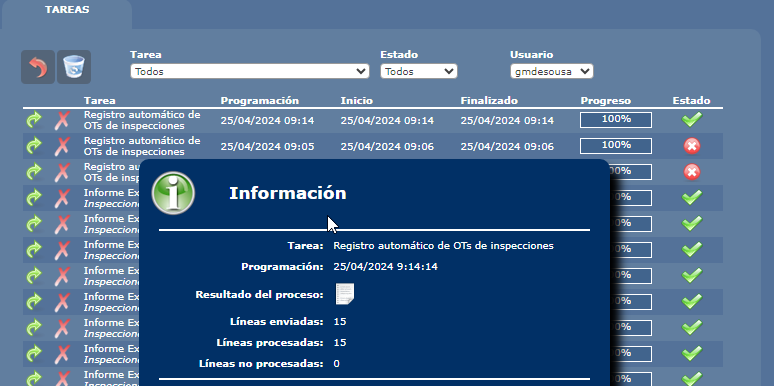


### Entrada de contratos

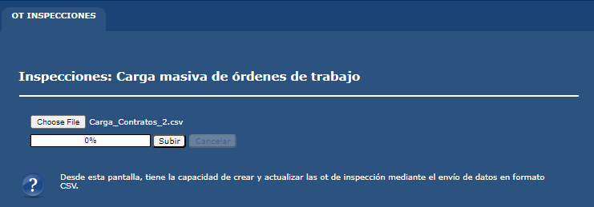

### Plantilla de la carga

```csv
CONTRATO GENERAL;CONTRATO ABONADO;ZONA ;Dir. Suministro;EMPLAZAMIENTO;INSPECCION
4730;4730;Zona 02;CL/ TERCIO DE LOS MORADOS, Nº 8;GENERAL exterior;3162
```
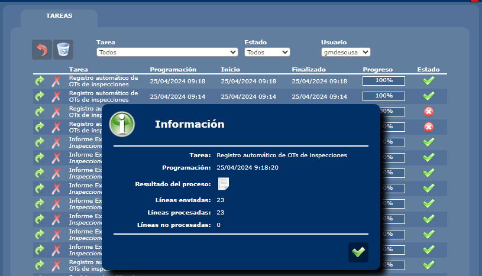


### Resultado de la carga

```SQL
SELECT * FROM otInspecciones_Melilla WHERE FechaCarga='2024-04-25T09:14:28.607'AND UsuarioCarga='gmdesousa'

SELECT * FROM otInspeccionesContratos_Melilla WHERE FechaCarga > '20240425'
```

### Inspecciones
| Line | objectid | contrato | otNum | ctrcod |
|------|----------|----------|--------|--------|
| 1    | 3160     | 7817     | 27892  | 7817   |
| 2    | 3161     | 5946     | 27893  | 5946   |
| 3    | 3162     | 4730     | 27894  | 4730   |
| 4    | 3185     | 4730     | 27895  | 4730   |
| 5    | 3320     | 6329     | 27896  | 6329   |
| 6    | 3321     | 6329     | 27897  | 6329   |
| 7    | 7900     | 8490     | 27898  | 8490   |
| 8    | 7901     | 8473     | 27899  | 8473   |
| 9    | 7902     | 8582     | 27900  | 8582   |
| 10   | 7903     | 8624     | 27901  | 8624   |
| 11   | 7904     | 8472     | 27902  | 8472   |
| 12   | 7905     | 8491     | 27903  | 8491   |
| 13   | 7906     | 29143    | 27904  | 29143  |
| 14   | 7907     | 9260     | 27905  | 9260   |
| 15   | 7908     | 13884    | 27906  | 13884  |


### Contratos

| Line | INSPECCION | CONTRATO GENERAL | CONTRATO ABONADO |
|------|------------|------------------|------------------|
| 1    | 3162       | 4730             | 4730             |
| 2    | 3185       | 4730             | 29293            |
| 3    | 3185       | 4730             | 29294            |
| 4    | 3185       | 4730             | 29295            |
| 5    | 3185       | 4730             | 29296            |
| 6    | 3185       | 4730             | 29297            |
| 7    | 3185       | 4730             | 29298            |
| 8    | 3185       | 4730             | 29299            |
| 9    | 3185       | 4730             | 29300            |
| 10   | 3185       | 4730             | 29301            |
| 11   | 3185       | 4730             | 29302            |
| 12   | 3185       | 4730             | 29303            |
| 13   | 3185       | 4730             | 29304            |
| 14   | 3185       | 4730             | 29305            |
| 15   | 3320       | 6329             | 6329             |
| 16   | 3321       | 6329             | 29284            |
| 17   | 3321       | 6329             | 29286            |
| 18   | 3321       | 6329             | 29287            |
| 19   | 3321       | 6329             | 29288            |
| 20   | 3321       | 6329             | 29289            |
| 21   | 3321       | 6329             | 29290            |
| 22   | 3321       | 6329             | 29291            |
| 23   | 3321       | 6329             | 29292            |


## Emitir las notificaciones

**Resultado esperado:** Una carta para cada contrato hijo, una carta para el contrato padre (si hay representantes, se emite un duplicado para el representante)

#### Inspecciones
| Line | objectid | contrato | otNum | ctrcod |
|------|----------|----------|--------|--------|
| 3    | 3162     | 4730     | 27894  | 4730   |
| 4    | 3185     | 4730     | 27895  | 4730   |

#### Contratos
| Line | INSPECCION | CONTRATO GENERAL | CONTRATO ABONADO |
|------|------------|------------------|------------------|
| 1    | 3162       | 4730             | 4730             |
| 2    | 3185       | 4730             | 29293            |
| 3    | 3185       | 4730             | 29294            |
| 4    | 3185       | 4730             | 29295            |
| 5    | 3185       | 4730             | 29296            |
| 6    | 3185       | 4730             | 29297            |
| 7    | 3185       | 4730             | 29298            |
| 8    | 3185       | 4730             | 29299            |
| 9    | 3185       | 4730             | 29300            |
| 10   | 3185       | 4730             | 29301            |
| 11   | 3185       | 4730             | 29302            |
| 12   | 3185       | 4730             | 29303            |
| 13   | 3185       | 4730             | 29304            |
| 14   | 3185       | 4730             | 29305            |


> Como ninguno tiene representante, vamos a asignarle representante a el contrato padre y a uno de los hijos

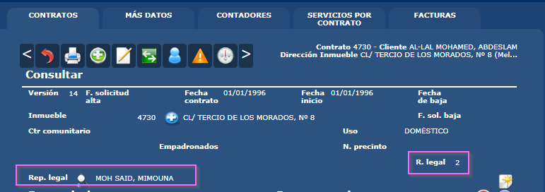

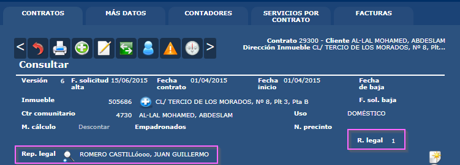
```SQL
SELECT CC.ctrcod, ctrValorc4, ctrRepresent 
FROM contratos AS C 
INNER JOIN vContratosUltimaVersion AS CC
ON C.ctrversion = CC.ctrVersion
AND C.ctrcod = CC.ctrCod
WHERE CC.ctrcod IN 
(4730,29293,29294,29295,29296,29297,29298,29299,29300,
29301,29302,29303,29304,29305)
AND ctrValorc4 IS NOT NULL
```

### Consultar el estado actual de las inspecciones (Aptas/No Aptas)

```SQL
SELECT * FROM vOtInspeccionesAptas_Melilla WHERE contrato=4730
```

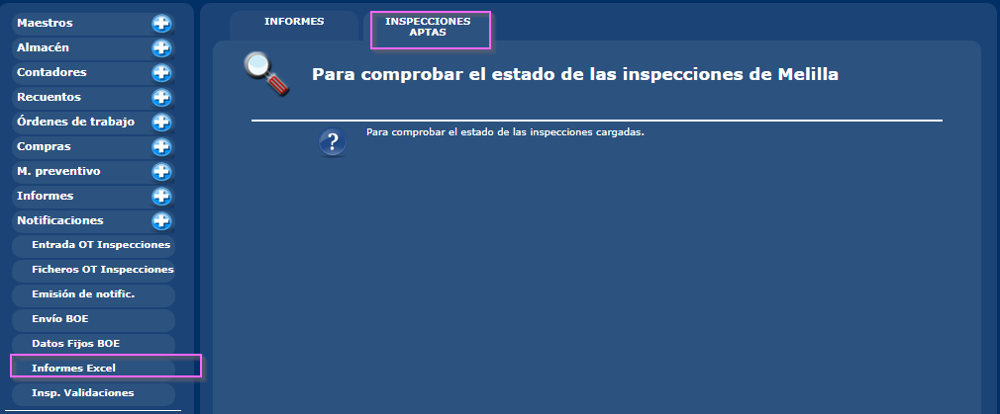
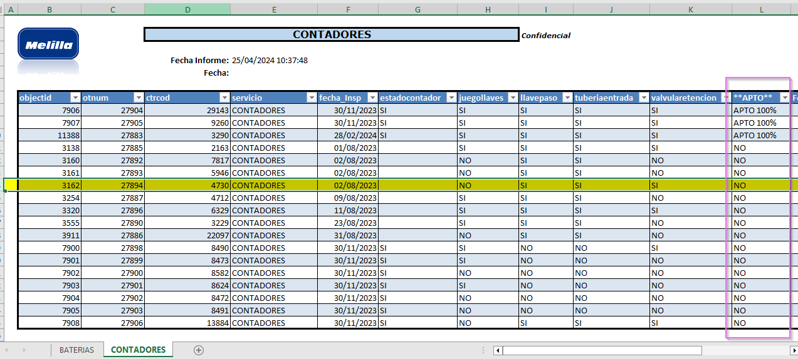


## Dirección para las cartas

Cambiamos la direccion del inmueble para asegurarnos que esta es la dirección que aparece en las cartas.

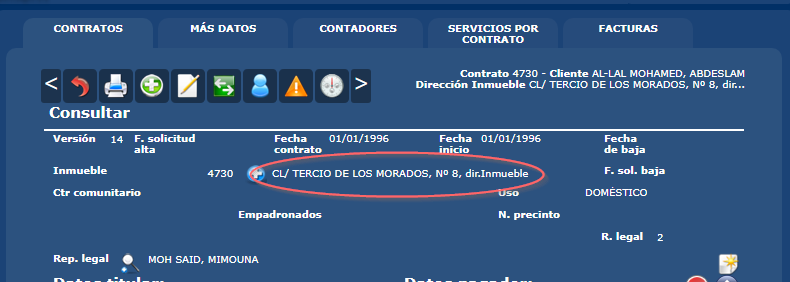

# Emision Contrato General (padre)

Para tener control de lo que hacemos hacemos la emisión  solo para los contratos que nos interesan, en esta primera emision sacamos al contrato de la inspección _(contrato padre)_

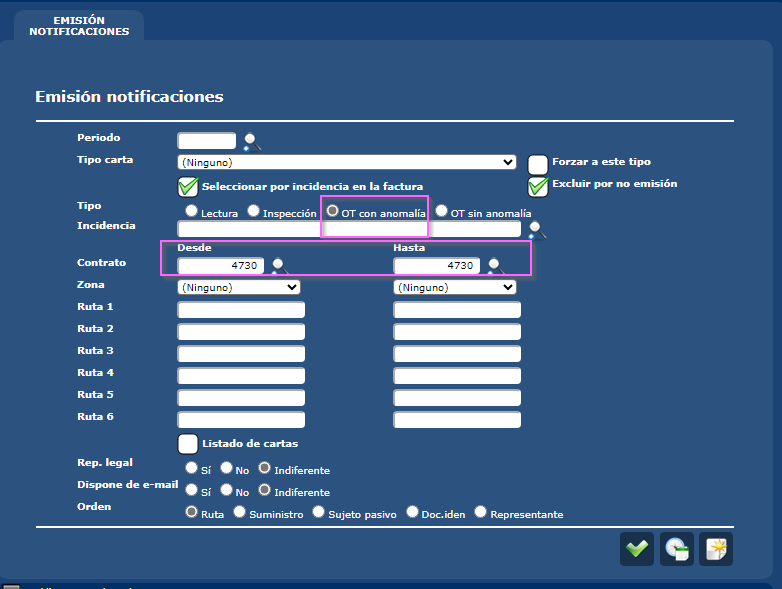


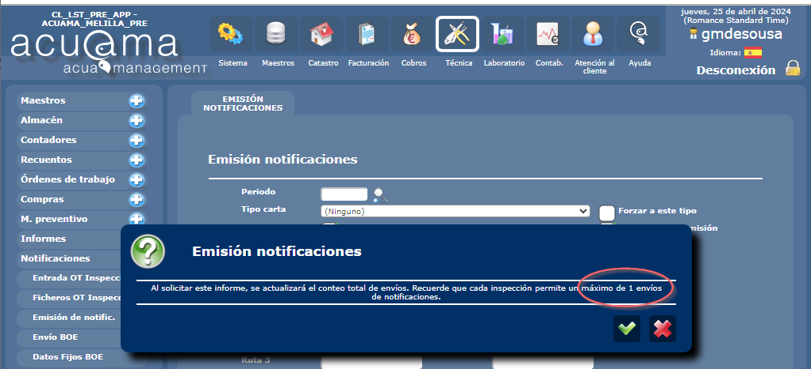

> Resultado esperado dos cartas por duplicado (4 en total): una para representante otra para titular.

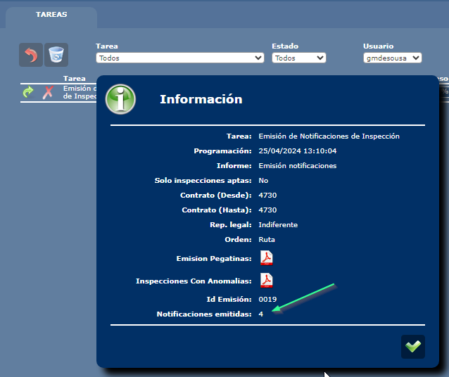

### Controlar el numero de emisiones (máximo 1)

> Ha fallado según lo esperado. No admite doble emision


### Pegatinas

- 4 cartas
- La direccion es la misma del inmueble
- Destinatario #1: Titular
- Destinatario #2: Representante

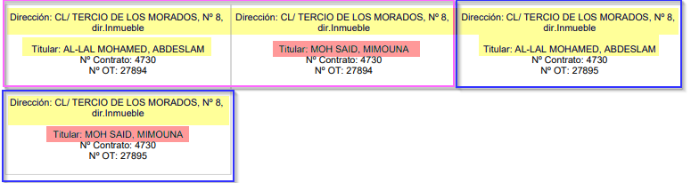


### Cartas

#### Titular
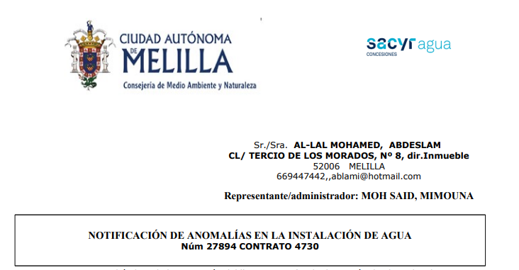

#### Representante
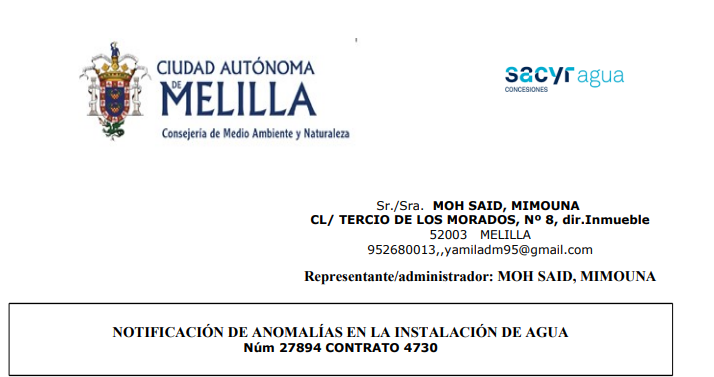


# Emision Contratos Abonados (hijos)

Ahora emitimos el rango de los contratos hijos.
Debe haber una carta por cada contrato y otra para cada representante

| Line | INSPECCION | CONTRATO GENERAL | CONTRATO ABONADO |
|------|------------|------------------|------------------|
| 1    | 3162       | 4730             | 4730 [^1]            |

| Line | INSPECCION | CONTRATO GENERAL | CONTRATO ABONADO |
|------|------------|------------------|------------------|
| 2    | 3185       | 4730             | 29293            |
| 3    | 3185       | 4730             | 29294            |
| 4    | 3185       | 4730             | 29295            |
| 5    | 3185       | 4730             | 29296            |
| 6    | 3185       | 4730             | 29297            |
| 7    | 3185       | 4730             | 29298            |
| 8    | 3185       | 4730             | 29299            |
| 9    | 3185       | 4730             | 29300 [^1]             |
| 10   | 3185       | 4730             | 29301            |
| 11   | 3185       | 4730             | 29302            |
| 12   | 3185       | 4730             | 29303            |
| 13   | 3185       | 4730             | 29304            |
| 14   | 3185       | 4730             | 29305            |


[^1]  Con representante legal

> Se esperan 13 cartas + 1 del representante legal del contrato 29300


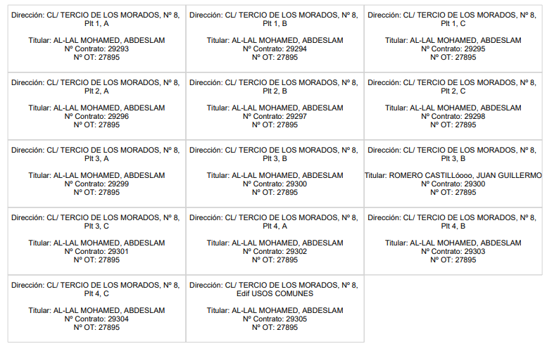

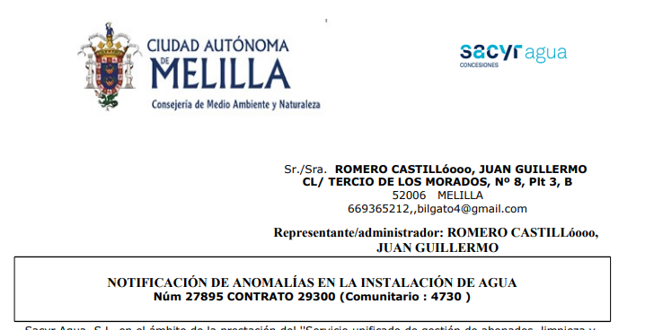

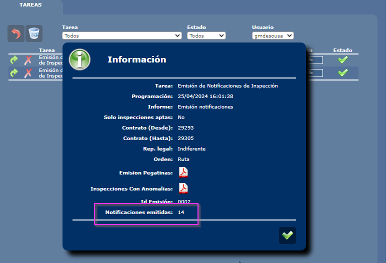


# Actualizar la fecha de la fecha de emisión para probar los 21 días

```SQL
--Fecha emision -30 DIAS
SELECT * 
--UPDATE E SET fecha= DATEADD(DAY, -30, fecha)
FROM [ReportingServices].[TO039_EmisionNotificaciones_Emisiones] AS E
WHERE usuario='gmdesousa' AND emisionID IN (1,3)
```

# Plantilla para los estados

```csv
notificacion;contrato;inspeccion;fecha1;codigo1;fecha2;codigo2;fecha_oficina;codigo_oficina;fecha_final;codigo_final;boe;fecha_envio_boe;fecha_pub_poe;fecha_ok_cambio;error_direccion
1;4712;36327;16/04/2024;1;;;;;;;;;;;

```
Estado enviados 

| notificacion | contrato | inspeccion | fecha1     | codigo1 |
|--------------|----------|------------|------------|---------|
| 900          | 4730     | 27894      | 27/03/2024 | 1       |
| 901          | 4730     | 27895      | 27/03/2024 | 2       |
| 902          | 29293    | 27895      | 27/03/2024 | 3       |
| 903          | 29294    | 27895      | 27/03/2024 | 4       |
| 904          | 29295    | 27895      | 27/03/2024 | 5       |
| 905          | 29296    | 27895      | 27/03/2024 | 6       |
| 906          | 29297    | 27895      | 27/03/2024 | 7       |
| 907          | 29298    | 27895      | 27/03/2024 | 1       |
| 908          | 29299    | 27895      | 27/03/2024 | 1       |
| 909          | 29300    | 27895      | 27/03/2024 | 2       |
| 910          | 29301    | 27895      | 27/03/2024 | 3       |
| 911          | 29302    | 27895      | 27/03/2024 | 4       |
| 912          | 29303    | 27895      | 27/03/2024 | 5       |
| 913          | 29304    | 27895      | 27/03/2024 | 6       |
| 914          | 29305    | 27895      | 27/03/2024 | 7       |

Codigos de estados
|   | Descripción             |
|---|-------------------------|
| 1 | Entregado              |
| 2 | Dirección incorrecta   |
| 3 | Ausente                |
| 4 | Desconocido            |
| 5 | Fallecido              |
| 6 | Rehusado               |
| 7 | No se hace cargo       |
| 8 | Entregado en lista     |
| 9 | No entregado en lista  |


```SQL
SELECT notificacion= ROW_NUMBER() OVER (ORDER BY CONTRATO, emisionEstado) + 900
, CONTRATO
, otNum
, fecha1 = CAST (DATEADD(DAY, 1, E.fecha) AS DATE)
  ,  CASE 
        WHEN FLOOR(RAND(CHECKSUM(NEWID())) * 6) + 1 > 1 THEN 1
        ELSE FLOOR(RAND(CHECKSUM(NEWID())) * 6) + 1
    END AS RandomNumber
FROM ReportingServices.TO039_EmisionNotificaciones_Notificaciones  AS N
LEFT JOIN ReportingServices.TO039_EmisionNotificaciones_Emisiones AS E
ON N.emisionID = E.emisionID

WHERE objectid=3185
```

## Informe para comprobar los estados de las entregas


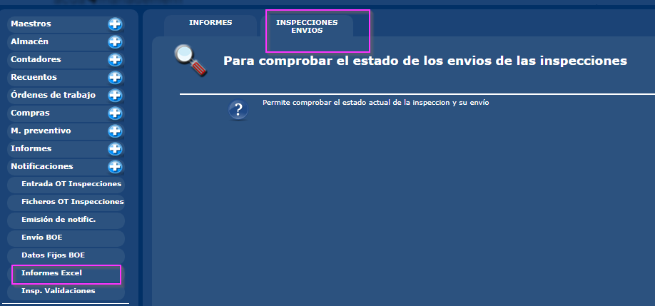

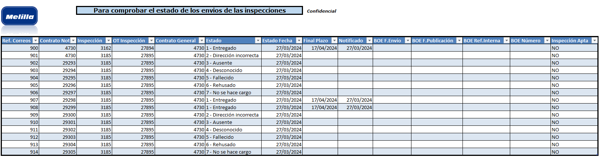


## Comprobar el estado de las emisiones desde la OT
### OT con Contrato General con Abonados: Se entrega OK

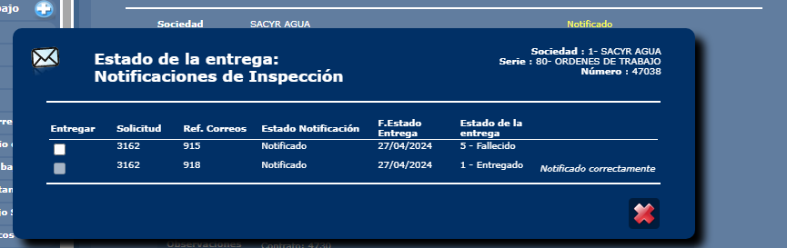

### OT con Contrato General sin Abonados: Se entrega OK


## Emitir OT de cambio de contador, se tienen en cuenta solo las entregadas.


## Actualizar la entrega en alguna OT y comprobar que este cambio se tiene en cuenta solo si han transcurrido los X días


# 📢 *Para probar la creación masiva de OTs de Cambio de contador*

```SQL
exec Contador_SelectInstalados @codigo=NULL,@contadorD=NULL,@contadorH=NULL,@contratoD=NULL,@contratoH=NULL
,@diasPlazoD=40,@fechaCompraD=NULL,@fechaCompraH=NULL,@fechaInstalacionD=NULL,@fechaInstalacionH=NULL
,@incidenciaCambioContador=0,@inciLecInspD=NULL,@inciLecInspH=NULL,@inciLecLectorD=NULL
,@inciLecLectorH=NULL,@ruta1=NULL,@ruta1H=NULL,@ruta2=NULL,@ruta2H=NULL,@ruta3=NULL,@ruta3H=NULL,@ruta4=NULL,@ruta4H=NULL
,@ruta5=NULL,@ruta5H=NULL,@ruta6=NULL,@ruta6H=NULL
,@SinOTAbiertas=0
,@SoloInspeccionesAptas=0
,@zonaD=NULL,@zonaH=NULL


SELECT V.*, M.usuariocarga
FROM votInspecciones_Melilla AS V
INNER JOIN otInspecciones_Melilla  AS M
ON M.objectid = V.objectid
WHERE usuariocarga='mmorenol' 
AND V.MOCK=0
```


# _Para revertir una emision_
```SQL
SELECT * 
--DELETE
FROM otInspeccionesNotificacionEmisiones_Melilla WHERE otineEmision=7

SELECT * 
--DELETE 
FROM ReportingServices.TO039_EmisionNotificaciones_Notificaciones WHERE emisionID = 7

SELECT * 
--DELETE 
FROM ReportingServices.TO039_EmisionNotificaciones_Emisiones WHERE emisionID=7
```

# _Para revertir todas las tablas_

```SQL
SELECT * 
--DELETE
FROM otInspeccionesContratos_Melilla

SELECT *
--DELETE
FROM otInspeccionesNotificacionEdo_Melilla

--EMISIONES
--DBCC CHECKIDENT ('otInspeccionesNotificacionEmisiones_Melilla', RESEED, 0);
SELECT * 
--DELETE
FROM otInspeccionesNotificacionEmisiones_Melilla

SELECT * 
--DELETE
FROM otInspecciones_Melilla


SELECT *
--DELETE
FROM Task_Schedule WHERE tskUser='gmdesousa' AND tskNumber=1


--DISABLE TRIGGER ordenTrabajo_DeleteCascada ON ordenTrabajo;
SELECT * 
--DELETE
FROM otDatosValor WHERE otdvOdtCodigo=2001

select * 
--DELETE
from ordenTrabajo
where otTipoOrigen='INSPMASIVO'
GO

--ENABLE TRIGGER ordenTrabajo_DeleteCascada ON ordenTrabajo;


SELECT *
--DELETE
FROM ReportingServices.TO039_EmisionNotificaciones_Notificaciones

--DBCC CHECKIDENT ('ReportingServices.TO039_EmisionNotificaciones_Emisiones', RESEED, 0);
SELECT * 
--DELETE
FROM ReportingServices.TO039_EmisionNotificaciones_Emisiones
```


## _REVERTIR EMISIONES_

```SQL
--EMISIONES
--DBCC CHECKIDENT ('otInspeccionesNotificacionEmisiones_Melilla', RESEED, 0);
SELECT * 
--DELETE
FROM otInspeccionesNotificacionEmisiones_Melilla

SELECT *
--DELETE
FROM ReportingServices.TO039_EmisionNotificaciones_Notificaciones

SELECT *
--DELETE
FROM ReportingServices.TO039_EmisionNotificaciones_Notificaciones

--DBCC CHECKIDENT ('ReportingServices.TO039_EmisionNotificaciones_Emisiones', RESEED, 0);
SELECT * 
--DELETE
FROM ReportingServices.TO039_EmisionNotificaciones_Emisiones

```