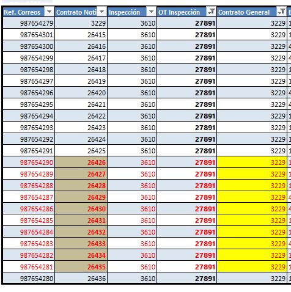
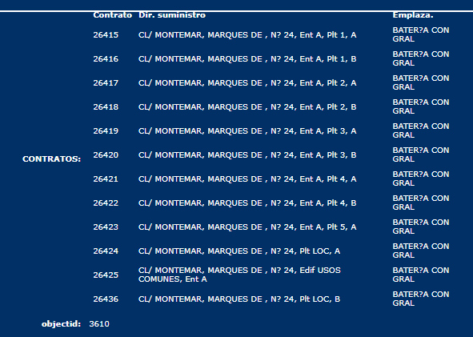
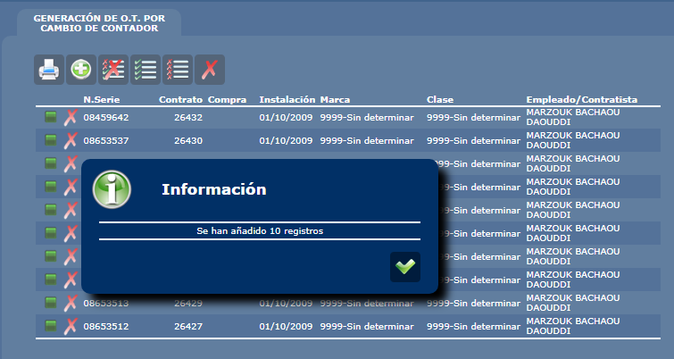
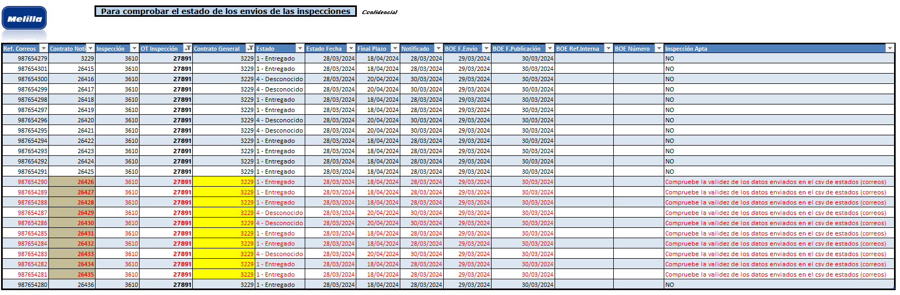

`Esperamos nos indiquen que hacer en este caso. Gracias!`

## 📫 Carga de estados

# _Dado que_ 
Se carga un csv con los estados de correos tal cual está en el archivo.

> `No se solicitó validación de los datos`

# _Cuando_

**Se envian datos erroneos** a la tabla de estados de las notificaciones. 

Se envian Contratos Hijos de la Inspeccion que no corresponden a lo está registrado para esta inspeccion.

##### 1️⃣ Estados correos:

> `Vease que los contratos enviados en el csv 26426-26435` no figuran como hijos de la inspección.

##### 2️⃣ Inspección:

# _Entonces_

Se ha permitido registrar estados de contratos hijos y notificaciones inexistentes.

# _Se observa_
Inconsistencia de datos para los informes y la emision masiva de ordenes de trabajo.

