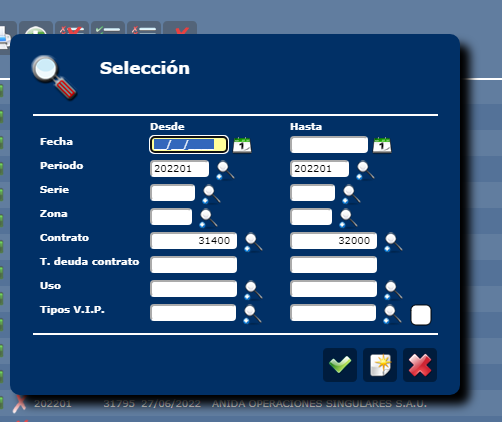
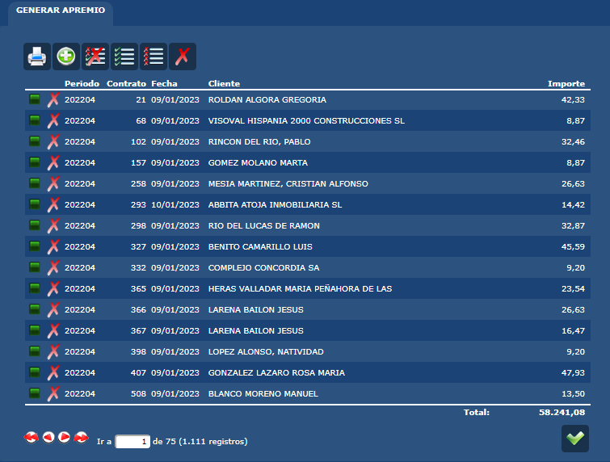

#  🧿 07 - User Story 85225: Guadalajara - Ajustes fichero de apremios y facturas

---
## 🛠 Preparativo para las pruebas

1. Generar un fichero de apremios desde pre. `Cobros\Apremios\Generar Apremios`

⚠ Guardar los filtros usados ya que luego vamos a generar exactamente los mismos apremios para poder comparar. `202201`



2. Usar la utilidad de parseo para extraer las columnas que están involucradas en la modificacion. `Guardar una copia para comparar con la nueva versión`





3. Borrar los apremios generados para volver a crearlos desde local

> 1. Para que pille los cambios de local tienes que lanzarlo on-line. Si lo lanzas como tarea va a ir al servicio de PRE.
> 2. Asegurate de tener el directorio `C:\Sacyr\workspace-git\Sacyr.Acuama\classic\Website\Ficheros\Apremios´para que no falle el ultimo paso que saca el archivo.


```SQL
SELECT 
--DELETE
FROM apremios WHERE aprFechaGeneracion>='20240522'

```

4. Repetir los pasos `1` y `2` en la versión local de acuama para comparar los resultados.

5. Comprobar con `Beyond Compare`:

> 1. La Fecha de emision, vencimiento y año se mantiene igual en todas las facturas no rectificadas
> 2. La Fecha de emision, vencimiento y año cambia en las facturas rectificativas


## 📦 Task 86318:  Revisión proceso de generación fichero de apremios
#### 📍 1- MILESTONE 8632 Cambios en el fichero de apremios para "FACTURAS DE CONSUMO" rectificativas


**Fecha de Emision**
- Facturas: Fecha incio pago voluntario `NO hay cambios`
- Facturas Rectificativas: Fecha de la factura rectificativa 👁‍🗨

**Fecha de Vencimiento**
- Facturas: Fecha fin pago voluntario `NO hay cambios`
- Facturas Rectificativas: Fecha de la factura rectificativa 👁‍🗨


**Año Emision**
- Facturas: AÑO Fecha incio pago voluntario `NO hay cambios`
- Facturas Rectificativas: AÑO Fecha de la factura rectificativa 👁‍🗨


---
[**sprint review**](readme.md)