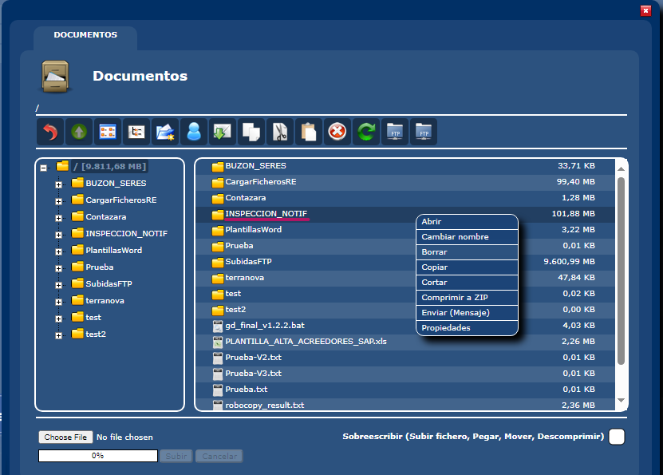
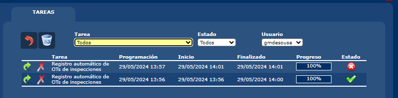
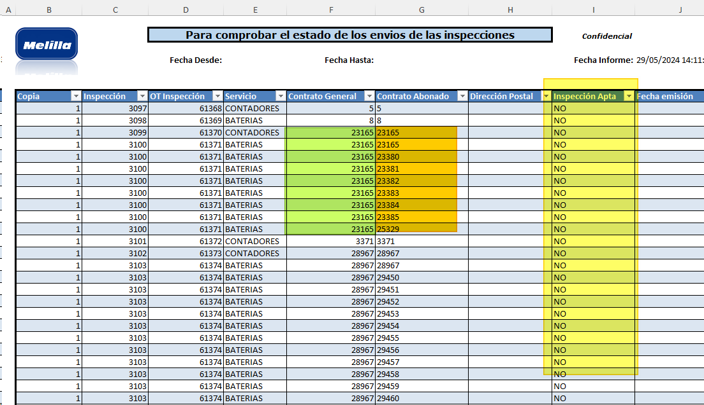
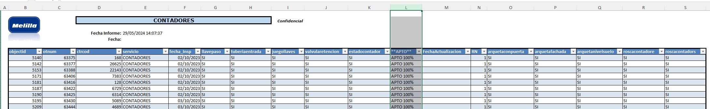
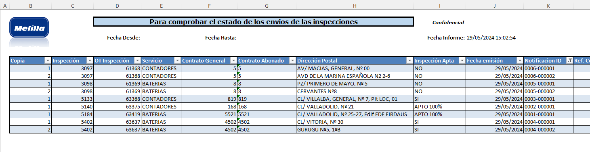

# ⚙ Casos de prueba para las notificaciones de inspecciones 

Existen 5 modelos de cartas

| Con Anomalía | Sin Anomalía |
|--------------|--------------|
|<p style="color:pink">TO039_CambioContadorOtConAnomalia.rdl</p>|<p style="color:pink">TO039_CambioContadorOtSinAnomalia.rdl</p>| 
| Apto-Bateria | Apto 100%(Bateria/Contador) |
| Apto-Contador | |
| No-apto-Bateria | |
| No-apto-Contador | |


## 1. Limpiar las tablas 

```SQL
SELECT * 
--DELETE
FROM otInspeccionesNotificacionEmisiones_Melilla WHERE otineEmision=7

SELECT * 
--DELETE 
FROM ReportingServices.TO039_EmisionNotificaciones_Notificaciones WHERE emisionID = 7

SELECT * 
--DELETE 
FROM ReportingServices.TO039_EmisionNotificaciones_Emisiones WHERE emisionID=7
```

# 🌟 Revertir todas las tablas

```SQL
SELECT * 
--DELETE
FROM otInspeccionesContratos_Melilla

SELECT *
--DELETE
FROM otInspeccionesNotificacionEdo_Melilla

SELECT * 
--DELETE
FROM otInspeccionesNotificacionEmisiones_Melilla

SELECT * 
--DELETE
FROM otInspecciones_Melilla

--*********************************************
--** Ordenes de trabajo: Deshabilitar el trigger **
--DISABLE TRIGGER ordenTrabajo_DeleteCascada ON ordenTrabajo;
--*********************************************
SELECT * 
--DELETE
FROM otDatosValor WHERE otdvOdtCodigo=2001

SELECT * 
--DELETE
FROM ordenTrabajo
WHERE otTipoOrigen='INSPMASIVO'
GO

--*********************************************
--** Ordenes de trabajo: Habilitar el trigger **
--ENABLE TRIGGER ordenTrabajo_DeleteCascada ON ordenTrabajo;
--*********************************************

SELECT *
--DELETE
FROM ReportingServices.TO039_EmisionNotificaciones_Notificaciones


SELECT * 
--DELETE
FROM ReportingServices.TO039_EmisionNotificaciones_Emisiones
```

### 1.1 Borrar las tareas para mi usuario

```SQL
SELECT *
--DELETE
FROM Task_Schedule WHERE tskUser='gmdesousa' AND tskNumber=1
```


## 🧹 Reiniciar el histórico de notificaciones

Para empezar todo de nuevo lo mejor es reinciar el contador de emisiones en 1 y borrar la carpeta del gestor documental.

>> ### ⚡ Reiniciar las emisiones en 1
>>
>>```SQL
>> --*********************************************
>> --EMISIONES: Resetear el autonumerico para el id de las emisiones
>> DBCC CHECKIDENT ('ReportingServices.TO039_EmisionNotificaciones_Emisiones', RESEED, 0);
>> --*********************************************
>>
>> --*********************************************
>> --EMISIONES: Resetear el autonumerico para el id de las emisiones
>> DBCC CHECKIDENT ('otInspeccionesNotificacionEmisiones_Melilla', RESEED, 0);
>> --*********************************************
>> ```
>>
>> ### ⚡ Borrar la carpeta del gestor documental: INSPECCION_NOTIF
>>
>> 

<br><br><br>

## 🛢 Realizar la carga masiva de inspecciones y contratos

Se adjuntan los ficheros **csv** de carga masiva **en este orden** 

1. MasivasINSPECCIONES V0.csv 
2. MasivasCONTRATOS_INSPECCIÓN V0.csv
3. UPDATE_MasivasBateriasApto100x100.csv

> [Ficheros](./CSV_CARGA)
>
> `Tecnica\Notificaciones\Entrada OT Inspecciones`
> 
>
> *Error no significa necesariamente un fallo total de la tarea.*

<br>
<br>


## 👓 Inspecciones por contratos (Generales & Abonados)

Como sabemos, una inspección se puede desglosar en multiples contratos abonados.
Este informe nos ayuda a consultar las inspecciones con todos los contratos abonados.

> `Tecnica\Notificaciones\Informes Excel\Inspecciones Envios`



El contrato general se repite para cada contrato abonado


## 👓 Estado de las inspecciones 

Generar el informe de estados: **"Inspecciones Aptas"**

> `Tecnica\Notificaciones\Informes Excel\Inspecciones Aptas`

La columna **APTO** nos ofrece información del estado de la inspección.



Con este listado comprobamos que tenemos inspecciones generarles para validar el estado.

| Con Anomalía | Sin Anomalía |
|--------------|--------------|
|<p style="color:pink">TO039_CambioContadorOtConAnomalia.rdl</p>|<p style="color:pink">TO039_CambioContadorOtSinAnomalia.rdl</p>| 
| Apto-Bateria | Apto 100%(Bateria/Contador) |
| Apto-Contador | |
| No-apto-Bateria | |
| No-apto-Contador | |


Con ayuda del informe podemos comprobar que tenemos inspecciones de **Contadores** y **Baterias**: <p style="color:pink">Apto.SI, Apto.NO, Apto100%</p>


# 📨 Emitir Notificaciones

Vamos ahora a emitir notificaciones para cada tipo de inspección con ayuda del informe
> `Tecnica\Notificaciones\Informes Excel\Inspecciones Envios`

Las emisiones se sacan desde
> `Tecnica\Notificaciones\Emision Notif.`

Aplicaremos los filtros por **Contratos Abonado** que queremos notificar.


| Con Anomalía | Sin Anomalía |
|--------------|--------------|
|<p style="color:pink">TO039_CambioContadorOtConAnomalia.rdl</p>|<p style="color:pink">TO039_CambioContadorOtSinAnomalia.rdl</p>| 
| "Apto-Bateria" Ctrcod: 4502 Emision#4 | "Apto 100%-Bateria" CtrCod: 5521 Emision#1 |
| "Apto-Contador" Ctrcod: 819 Emision#3 | "Apto 100%-Contador" CtrCod: 168 Emision#2 |
| "No-apto-Bateria" Ctrcod: 8 Emision#5 | |
| "No-apto-Contador" Ctrcod: 5 Emision#6 | |


> #### 💡 Puedes comprobar las emisiones con el mismo informe `Tecnica\Notificaciones\Informes Excel\Inspecciones Envios`





#  ✂ Deshacer una emisión (Para re-emitir)

En este ejemplo estamos borrando las notificaciones dentro de la emisión #11 porque queremos permitir que se pueda volver a emitir.

> #### 💡 En la tabla `ReportingServices.TO039_EmisionNotificaciones_Emisiones` estan los filtros que se usaron originalmente para hacer esta emisión

```SQL
SELECT *
--DELETE
FROM ReportingServices.TO039_EmisionNotificaciones_Notificaciones WHERE emisionID=11

SELECT * 
--DELETE
FROM otInspeccionesNotificacionEmisiones_Melilla WHERE otineEmision=11


--INFO
SELECT * 
FROM ReportingServices.TO039_EmisionNotificaciones_Emisiones WHERE emisionID=11


```
