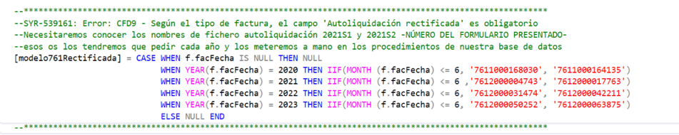

# ✨ Modelo 762 junta de Andalucía 

- Emisión para la la carga de la declaracion **Anual**  del servici0 20-CANON VARIABLE de AVG.

- Es un fichero txt que se usa como entrada para cargar el modelo 762 de la Junta de Andalucía.

- Contiene las lineas de factura con el servicio **20-CANON VARIABLE** para el ejercicio en consulta.
<br><br>

- El txt generado no incluye cabeceras. Para facilitar la inspección del fichero contamos con este excel de cabeceras.

> ### 📑 [Cabeceras para el txt](<readme/_Especificaciones Tecnicas_762_AVG.xlsx>)

<br><br>


### 📅 Emisión Anual 

- Para el primer semestre del año **2023** todas las líneas de canon de las facturas de AVG deben salir a importe 0.

- Contratos con líneas de **20-CANON VARIABLE** a 0.00 hasta antes del 2023 se omitían del fichero generado. 

- En adelante deben salir siempre, aunque sean 0.00
<br><br>

### 📜 Boletín Oficial de la Junta Andalucía

> #### **2023**-07-21: [Especificaciones del fichero](/readme/BOJA23-139-00031-12119-01_00287147.pdf) 
<br><br><br><br>


# ✍ Paso#1: Edición Manual

### 🛢 Para las facturas rectificativas es necesario editar manualmente la <span style="color:pink;">query</span>. 

Este error sale cuando hay rectificadas en el listado y no está actualizada la query con el numero de formulario 761 de los semestres anteriores. 

```sql
Tipo de registro: F. Identificación: 32662 - H72128473 - 31/05/2023 - 23/08/2023 -23100015 - S2
Error: CFD9 - Según el tipo de factura, el campo 'Autoliquidación rectificada' es obligatorio.
```

 > En el procedimiento Liquidaciones_Select_AVG_Detalle debemos actualizar año a año el Numero del formulario 761 para los dos semestres.
 >
> Margari nos los envía por correo para actualizar el sp: 
 >
 > 
 
<br><br>


### 👩‍💻 La usuaria siempre hace una edición manual del fichero para completar datos que ahora no están en acuama

> #### Actualizar los datos del cliente <span style="color:pink;">**“A11768546”**<span>

> - **Tipo A:** La penúltima línea totaliza los consumos que AVG factura al cliente.
> - **Tipo  S:** La antepenúltima es el consumo facturado por el cliente a AVG.


 
# 📤 Paso#2: Validación

### Enviar el fichero a la junta para su validación

> Si hay errores nos enviarán un listado detallado con las advertencias y errores generados durante la carga. 
>
> Comprobar que los datos del fichero cumplen con la especificación funcional
>
> **2023**-07-21: [Especificaciones del fichero](/readme/BOJA23-139-00031-12119-01_00287147.pdf) 

<br><br><br><br>


# 📥 Paso#3: Borrador

### Si la validación del txt es exitosa, se recibe un borrador en en lugar del fichero de errores.

> Este fichero permite la comprobación preliminar del borrador antes del envio definitivo.

<br><br><br><br>

# 📨 Soporte: Junta de Andalucía

- Centro de Información y Servicios (CEIS)  de la Consejería de Economía, Hacienda y Fondos Europeos  cuyo número de teléfono es el 955 40 55 88.

- También pueden ponerse en contacto a través del siguiente enlace:
> 🔗 https://juntadeandalucia.es/organismos/economiahaciendayfondoseuropeos/consultas.html


```SQL
Buenas tardes,

Con objeto de que los analistas puedan comprobar a que obedecen los errores en la confección del modelo 762 deberán poner una incidencia al Centro de Información y Servicios (CEIS)  de la Consejería de Economía, Hacienda y Fondos Europeos  cuyo número de teléfono es el 955 40 55 88.

También pueden ponerse en contacto a través del siguiente enlace  https://juntadeandalucia.es/organismos/economiahaciendayfondoseuropeos/consultas.html

Saludos

María González

--
María González Pérez

Jefa del Servicio de Gestión de Tributos del Agua
Secretaría General del Agua
Consejería de Agricultura, Pesca, Agua y Desarrollo Rural

Avenida de Grecia s/n 41012 - Sevilla
T: T: 955 003 537 (Corp. 303 537) | M: M: 671 532 024 (Corp. 632024)
mariac.gonzalez.perez@juntadeandalucia.es | www.juntadeandalucia.es
```